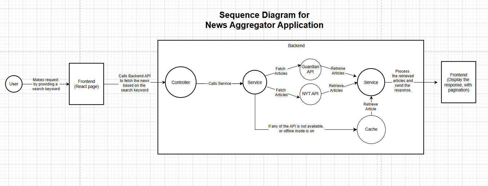

# News Aggregator Application

A full-stack application that aggregates news articles from The Guardian and New York Times APIs, providing a seamless search experience with deduplication, pagination, and offline mode support.

### **Features**
* Search News: Fetch articles by keyword with pagination.
* Deduplication: Remove duplicate articles from multiple sources.
* Offline Mode: Serve cached results when APIs are unavailable.
* HATEOAS: RESTful navigation with nextPage and prevPage links.
* Swagger Documentation: Interactive API documentation.
----------------------------------------------------------------------------------
### **Tech Stack**
* Backend: Java, Spring Boot, WebClient, Lombok
* Frontend: React, Axios, Tailwind CSS
* CI/CD: Jenkins, Docker, Docker Compose
* Testing: JUnit 5, Mockito, WireMock
* Documentation: Swagger/OpenAPI
-----------------------------------------------------------------------------------
### **Design and Implementation Approach**

#### 1. **Architecture**
The application follows a layered architecture:

* Controller Layer: Handles HTTP requests and responses.
* Service Layer: Implements business logic (e.g., deduplication, pagination).
* Client Layer: Fetches data from external APIs (Guardian, NYT).
* Cache Layer: Stores results for offline mode.

2. #### **Sequence Diagram**

-----------------------------------------------------------------------------------------
### **Design Patterns**

#### 1. Strategy Pattern

* Purpose: Encapsulate interchangeable algorithms for fetching news from different APIs.
* Implementation: NewsClient interface with GuardianClient and NYTClient implementations.

#### 2. Builder Pattern
* Purpose: Simplify the creation of complex objects (e.g.: ResponseDTO).
* Implementation: Lombok’s @Builder annotation.

#### 3. Singleton Pattern
* Purpose: Ensure a single instance of the cache service.
* Implementation: Spring’s @Service annotation.

#### 4. Facade Pattern
* Purpose: Provide a simplified interface to the complex logic of fetching and aggregating news.
* Implementation: NewsService acts as a facade for the controller.
----------------------------------------------------------------------------------------------------------------